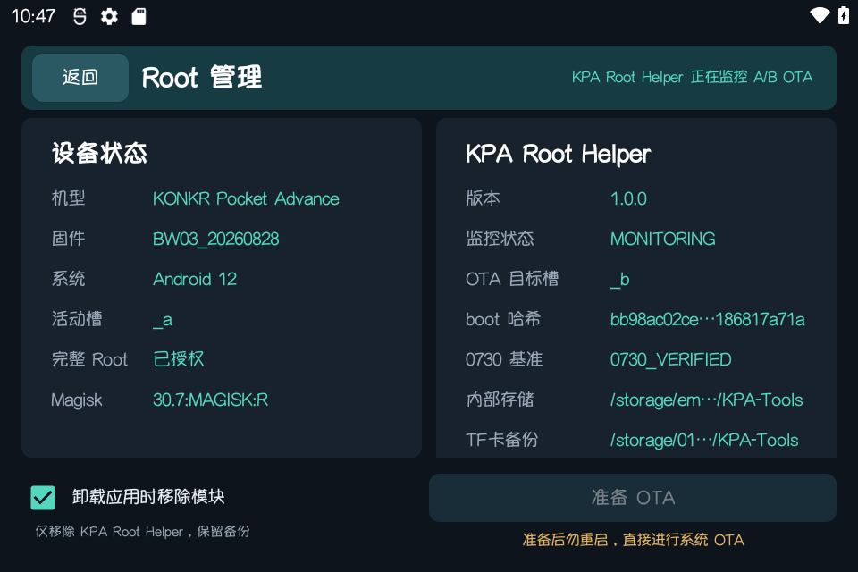
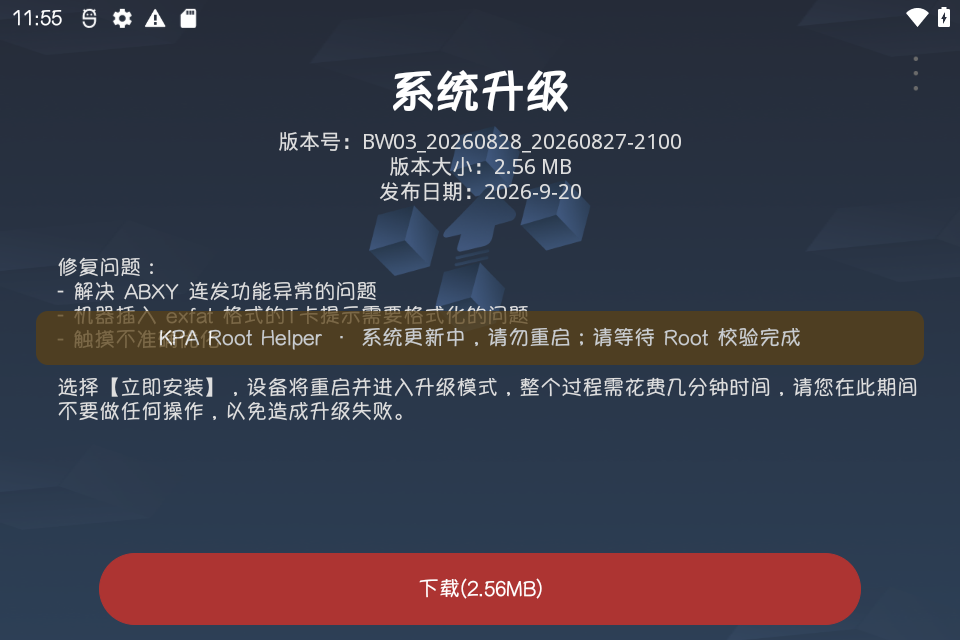
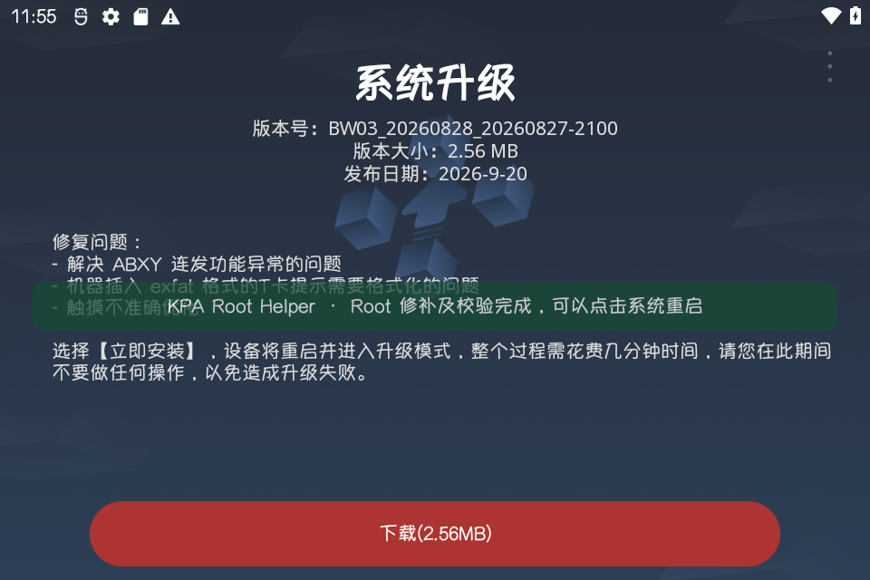
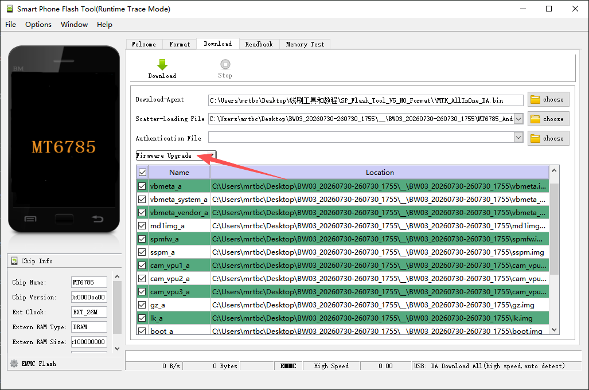

# KPA Root

[English](README.en.md) | [简体中文](README.md)

Bootloader unlock, Root and restore toolkit for KONKR Pocket Advance.

Chinese and English documentation and launchers are available.

> [!CAUTION]
> This toolkit can reconstruct and patch boot images from official incremental OTAs, so it will generally support later official firmware without waiting for a toolkit update. When a new OTA is available, first run `3_Restore_EN.cmd` to restore the stock boot for the current system. Complete the official OTA, then run `2_Root_EN.cmd` to restore Root on the updated system. Using the **KPA Tools Root edition** is recommended: before the OTA, open Root Manager and select **Prepare for OTA**. After preparation completes, install the official OTA normally; KPA Root Helper will automatically patch and verify Root for the updated system.

> [!WARNING]
> Direct KPA-Root flashing has been verified on `BW03_20260730` and `BW03_20260828`. The same device also completed two consecutive automatic official OTA patching loops, `0730 → 0813` and `0813 → 0828`. Any boot write may still cause boot failure, data loss, or device damage. Proceed at your own risk.

## Supported devices

- Model: `GT78-VN`
- Board: `k85v1_64`
- Firmware: bundled for `BW03_20260730`, `BW03_20260813` and `BW03_20260828`; boot images can be generated for later official incremental builds
- Root: Magisk 30.7 with Zygisk
- Host: Windows; ADB and Fastboot are included

Before any change, the scripts verify the model, firmware, active slot, bootloader state, image size and SHA-256. Root and restore operations target only the active slot; the user never selects A or B manually.

## Buttons and boot modes

- While powered off, hold Power + `MODE` to open the boot-mode menu.
- Press `MODE` to cycle through `Recovery Mode`, `Fastboot Mode` and `Normal Mode`, then press `LC` to confirm.
- In Recovery, use the volume wheel to move up or down; `MODE` can also cycle through the choices. Press Power to confirm.
- Fastboot Volume Up / YES corresponds to the `MODE` button to the right of `L2`.

## Workflow

### 1. Unlock the bootloader

On the handheld, open **Settings → System → Developer options**, enable **OEM unlocking** and **USB debugging**, and authorize this computer.

Run `1_Unlock_EN.cmd`.

Unlocking normally erases all user data. Back up first.

### 2. Obtain Root

Run `2_Root_EN.cmd`.

Check the firmware version again before flashing.

The script always reuses and verifies an existing image first. Only when the current firmware image is missing, it queries and downloads official adjacent incremental OTAs, reconstructs the current stock boot from an earlier stock boot, and patches it with the bundled Magisk 30.7. After preflight and user confirmation, it flashes only the active slot, installs Magisk, enables Zygisk and verifies Root.

Automatic generation requires Internet access, a complete official incremental chain and a working ADB connection. OTA archives retain their server filenames under `ota-cache`. Existing 0730, 0813 and 0828 images are never regenerated or overwritten.

The package also includes:

- KPA MYuppy Font
- KPA RGB Control
- Play Integrity Fork
- Shamiko
- Dolby Atmos Razer Phone 2 (landscape graphical equalizer fix)

Missing modules are installed with a Magisk `disable` marker, so they remain disabled by default. Existing installations are skipped without changing their state. Enable a module manually in Magisk and reboot when needed.

### Dolby Atmos

Upstream project：[Dolby Atmos Razer Phone 2](https://github.com/reiryuki/Dolby-Atmos-Razer-Phone2-Magisk-Module)

Fixes the graphical equalizer display in landscape.

Before use, go to **Settings → Sound → Sound enhancement** and enable **BesLoudness (speaker volume booster)**.

> Enabling Dolby changes the reported device identity to Razer Phone 2, which may affect vendor apps.

### 3. Restore stock boot

Run `3_Restore_EN.cmd`.

Restore also writes the boot partition and uses the same OTA reconstruction feature as the Root script. If the stock boot for the installed firmware is missing, it rebuilds that version step by step from an earlier stock boot and official adjacent incremental OTAs. Restore proceeds only after verification, so later normal OTA releases usually do not require a newly packaged KPA-Root toolkit.

Automatic reconstruction requires Internet access, a continuous official incremental chain and a working ADB connection. If the vendor changes the service or package format, or the chain is incomplete, the script stops without flashing.

The script restores the stock boot matching the current firmware and active slot. It can optionally relock the bootloader; relocking normally erases user data again.

> [!WARNING]
> Relocking the bootloader is not recommended. Restoring stock boot alone cannot prove that every other partition is official and unmodified. Relocking with a mismatched or modified partition may prevent the device from booting.

## OTA workflow

### Using KPA-Root scripts only

1. Before the OTA, run `3_Restore_EN.cmd` to restore the active slot's matching stock boot. Relocking the bootloader is not required.
2. Boot the stock system normally and install the official OTA.
3. After the first successful boot into the new firmware, run `2_Root_EN.cmd`.
4. The script detects the new build. If its boot is missing, it reconstructs it from an earlier stock boot and official adjacent incremental OTAs, then patches and flashes the current active slot.

Never flash a patched boot from an older firmware into a newer build.

### Using KPA Tools Root edition

The [KPA Tools Root edition](https://github.com/tbc0309/KPA-Tools/releases/latest) is recommended. KPA Root Helper restores the active slot's stock boot before System Update, then backs up, patches, and verifies the new slot after the official OTA while keeping the old slot on its matching stock boot. Restart only after the green **Ready to restart** notice appears on the System Update screen.

| Updating or patching: do not restart | Patch verified: restart allowed |
| --- | --- |
|  |  |

## Official Fastboot firmware

- 中文：[AYANEO 服务支持下载](https://ayaneo.com.cn/support/download)
- English: [AYANEO Support Download](https://www.ayaneo.com/support/download)

The download pages directly list the KONKR Pocket Advance flashing tools, instructions, and Fastboot ROM. The Chinese page includes the flashing-tool guide and 0730 package; the English page lists the 0730 Fastboot ROM.

> [!WARNING]
The official download is an MTK Fastboot flashing package, not an in-system card-update OTA. It writes multiple partitions and may erase data. Follow the matching official tool and instructions exactly, and never disconnect USB while flashing.

### Flashing mode

Select **`Firmware Upgrade`** in SP Flash Tool. Do not use `Download Only` or `Format All + Download`.

The official package provides the A-slot boot partitions. `Download Only` does not complete the required A/B slot transition for this package and may preserve the previously active slot, causing the handheld to return to Fastboot after flashing. If this happens, flash the package again with **`Firmware Upgrade`**. Manually forcing slot A is not part of the normal recovery procedure. The first boot may take 5–10 minutes; do not force the device off early.

An official line flash may leave equal A/B priorities in `misc`. KPA-Root does not use those priorities to select a flash target: it reads the slot currently running Android, then verifies Fastboot `current-slot` before allowing the operation to continue.

## Release builds

Font, RGB, Play Integrity Fork and Shamiko are downloaded from upstream stable releases. Dolby uses the pinned UI fix archive with SHA-256 verification. Building requires 7-Zip; running the toolkit does not.

See [`toolkit/README_EN.md`](toolkit/README_EN.md) for the complete English guide.

Copyright © 2026 IMNKS.COM.

[IMNKS.COM](https://imnks.com/) · [GitHub](https://github.com/tbc0309)
