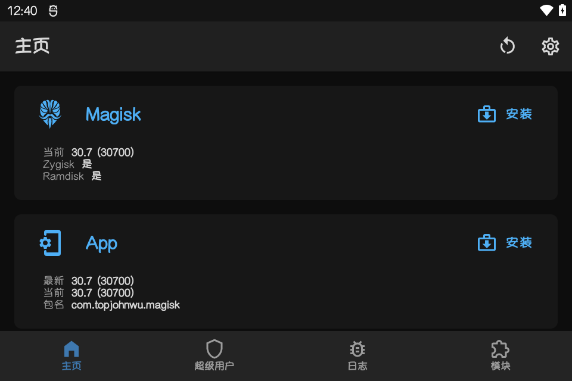

# KPA Root

[English](README.en.md) | [简体中文](README.md)

适用于 KONKR Pocket Advance 的 Bootloader 解锁、Root 和恢复工具包。

提供中文和英文文档及启动脚本。

> [!WARNING]
> 目前仅 `BW03_20260828` 在当前这台机器上完成实机测试，`BW03_20260730` 和 `BW03_20260813` 未实机验证。刷写存在无法启动、数据丢失甚至设备损坏的风险，不提供安全保证，请自行承担风险。

## 支持范围

- 型号：`GT78-VN`
- 主板：`k85v1_64`
- 固件：`BW03_20260730`、`BW03_20260813`、`BW03_20260828`
- Root：Magisk 30.7 + Zygisk
- 系统：Windows，已包含 ADB/Fastboot 工具

脚本会在操作前检查设备型号、固件版本、活动槽、Bootloader 状态、镜像大小和 SHA-256。Root 与恢复只处理当前活动槽，用户不需要手动选择 A/B 槽。

## 按键与启动模式

- 关机状态下同时按住“开机键 + MODE”，进入启动模式菜单。
- 使用 `MODE` 在 `Recovery Mode`、`Fastboot Mode` 和 `Normal Mode` 之间循环选择，按 `LC` 确认。
- 进入 Recovery 后，使用音量滚轮上下选择；也可以按 `MODE` 循环选择。按开机键确认。
- Fastboot 的“音量+ / YES”对应 `L2` 右侧的 `MODE` 按键。

## 使用顺序

### 1. 解锁 Bootloader

运行：

- `1_Unlock_CN.cmd`

解锁通常会清除全部用户数据，请先备份。

### 2. 获取 Root

运行：

- `2_Root_CN.cmd`

刷写前请再次确认固件版本。除 0828 外，0730 和 0813 镜像尚未实机测试，无法保证能够正常启动或恢复。

脚本自动匹配 0730、0813 或 0828 的 Magisk boot，只刷入当前活动槽；随后安装 Magisk、开启 Zygisk，并验证 Root 状态。

工具包同时携带：

- KPA MYuppy Font
- KPA RGB Control
- Play Integrity Fork
- Shamiko
- Dolby Atmos Razer Phone 2（横屏图形均衡器修复版）

缺失模块会自动安装，但默认写入 Magisk `disable` 标记，不会自动启用。已有模块会直接跳过，其启用状态不会改变。需要使用时，在 Magisk 中手动启用并重启。

### Dolby Atmos

原项目：[Dolby Atmos Razer Phone 2](https://github.com/reiryuki/Dolby-Atmos-Razer-Phone2-Magisk-Module)

修复横屏图形均衡器显示。

使用前，请进入 **设置 → 声音 → 音效改善**，开启 **BesLoudness（喇叭音量助推器）**。

> 启用 Dolby 后，系统机型信息会显示为 Razer Phone 2，可能影响厂商应用。

### 3. 恢复原版 boot

运行：

- `3_Restore_CN.cmd`

恢复脚本同样会写入 boot 分区。0730 和 0813 的恢复流程尚未实机测试；镜像或版本不匹配可能导致无法启动。

脚本恢复当前固件和活动槽对应的原版 boot。完成后可选择是否重新锁定 Bootloader；锁定通常会再次清除数据。

> [!WARNING]
> 不建议重新锁定 Bootloader。即使已经恢复原版 boot，也无法仅凭本工具确认其他分区全部为官方原版；锁定状态下若存在不匹配或已修改分区，可能导致设备无法启动。

## OTA 注意事项

安装 OTA 前必须先恢复当前固件对应的原版 boot。OTA 完成并确认新固件版本后，需要使用新版本对应的修补 boot；不要把旧版 boot 刷入新版系统。

## 官方刷机包

- [官方下载页](https://ayaneo.com.cn/support/download)

进入页面后依次选择“Android 掌机”→“KONKR Pocket Advance”。

> [!WARNING]
> 官网目前提供的包应按卡刷更新包使用，不是经过确认的完整线刷恢复包。卡刷不能保证覆盖所有底层分区，也不一定能把设备恢复到完整原厂状态；设备无法进入系统或 Recovery 时，不应把它当作线刷救砖包使用。

## 构建发布包

字体、RGB、Play Integrity Fork 和 Shamiko 从上游正式发布下载；Dolby 使用仓库内固定的修复包并校验 SHA-256。构建需安装 7-Zip，运行工具包不需要。

完整中文说明见 [`toolkit/README_CN.md`](toolkit/README_CN.md)。

Copyright © 2026 我不是矿神。

[IMNKS.COM](https://imnks.com/) · [GitHub](https://github.com/tbc0309)
